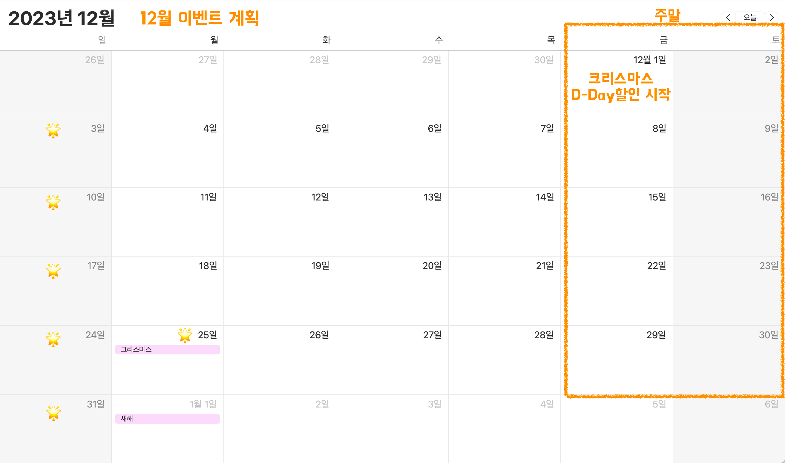

# 목차
1. [크리스마스 프로모션 개요](#🎄-크리스마스-프로모션-개요)
2. [기능 목록](#📋-기능-목록)
3. [예외 상황](#⚠️-예외 상황)


# 🎄 크리스마스 프로모션 개요

2023년 12월, 우테코 식당에서 1년 중 제일 큰 이벤트를 개최합니다.

해당 이벤트를 통해 지난 5년 중 최고의 판매 금액을 달성하고자 하며, 12월 이벤트 참여 고객의 5%가 내년 1월 새해 이벤트에 재참여하게 만드는 것이 목표입니다.

<br>

이벤트의 메뉴는 다음과 같습니다.

```
<애피타이저>
양송이수프(6,000), 타파스(5,500), 시저샐러드(8,000)

<메인>
티본스테이크(55,000), 바비큐립(54,000), 해산물파스타(35,000), 크리스마스파스타(25,000)

<디저트>
초코케이크(15,000), 아이스크림(5,000)

<음료>
제로콜라(3,000), 레드와인(60,000), 샴페인(25,000)
```

<br>

이벤트 진행 계획은 다음과 같습니다.




<br>

# 📋 기능 목록

크리스마스 프로모션 이벤트 진행을 위해 구현해야 할 기능 목록입니다.

## 1. 고객 입력
- [x] 고객은 식당에 방문할 날짜를 선택할 수 있습니다.
    - 방문할 날짜는 1 이상 31 이하의 숫자로 입력할 수 있습니다.
- [x] 고객은 메뉴를 미리 선택할 수 있습니다.
    - 음료만 주문할 수 없습니다.
    - 메뉴는 한 번에 최대 20개까지 주문할 수 있습니다.

<br>

## 2. 이벤트 내용
- [x] 총주문 금액 10,000원 이상부터 이벤트가 적용됩니다.
- [x] 할인과 증정은 중복 적용됩니다.
- [x] 이벤트는 크리스마스 디데이 할인, 평일 할인, 주말 할인, 특별 할인, 증정 이벤트로 총 5가지가 있습니다. 자세한 내용은 아래와 같습니다.
  - [x] 크리스마스 디데이 할인
      - 이벤트 기간: 2023.12.1 ~ 2023.12.25
      - 1,000원으로 시작하여 크리스마스가 다가올수록 날마다 할인 금액이 100원씩 증가
      - 총주문 금액에서 해당 금액만큼 할인(e.g. 시작일인 12월 1일에 1,000원, 2일에 1,100원, ..., 25일엔 3,400원 할인)
  - [x] 평일 할인(일요일~목요일): 평일에는 디저트 메뉴를 메뉴 1개당 2,023원 할인
  - [x] 주말 할인(금요일, 토요일): 주말에는 메인 메뉴를 메뉴 1개당 2,023원 할인
  - [x] 특별 할인: 이벤트 달력에 별이 있으면 총주문 금액에서 1,000원 할인
  - [x] 증정 이벤트: 할인 전 총주문 금액이 12만 원 이상일 때, 샴페인 1개 증정
- [x] '크리스마스 디데이 할인'을 제외한 다른 이벤트는 2023.12.1 ~ 2023.12.31 동안 적용됩니다.

<br>

## 3. 이벤트 혜택 미리 보기
- 사용자 입력 후 이벤트 혜택 내용을 보여줄 수 있습니다. 자세한 내용은 아래와 같습니다.
  - [x] 주문 메뉴
  - [x] 할인 전 총주문 금액
  - [x] 증정 메뉴
      - [x] 증정 이벤트에 해당하지 않는 경우, 증정 메뉴 "없음"으로 표시됩니다.
  - [x] 혜택 내역
      - [x] 고객에게 적용된 이벤트 내역이 표시됩니다.
      - [x] 적용된 이벤트가 하나도 없다면 혜택 내역 "없음"으로 표시됩니다.
  - [x] 총혜택 금액
      - [x] 총혜택 금액은 ‘할인 금액의 합계 + 증정 메뉴의 가격’입니다.
  - [x] 할인 후 예상 결제 금액
      - [x] 할인 후 예상 결제 금액은 ‘할인 전 총주문 금액 - 할인 금액’입니다.
  - [x] 12월 이벤트 배지
      - [x] 총혜택 금액에 따라 이벤트 배지의 이름이 다르게 표시됩니다. 자세한 내용은 아래와 같습니다.
          - 5천 원 이상: 별
          - 1만 원 이상: 트리
          - 2만 원 이상: 산타
      - [x] 이벤트 배지가 부여되지 않는 경우, "없음"으로 표시됩니다.

<br>

# ⚠️ 예외 상황

사용자가 잘못된 값을 입력할 경우 IllegalArgumentException를 발생시키고 다시 입력을 받습니다.

- [x] 고객이 입력한 방문 날짜가 1 이상 31 이하의 숫자가 아닐 경우
- [x] 고객이 메뉴판에 없는 메뉴를 입력하는 경우
- [x] 각 메뉴의 개수가 1 이상의 숫자가 아닐 경우
- [x] 총 주문한 메뉴의 개수가 20개를 초과할 경우
- [x] 메뉴 형식이 ‘$메뉴-$개수’가 아닐 경우
- [x] 중복 메뉴를 입력한 경우
- [x] 음료만 주문한 경우
